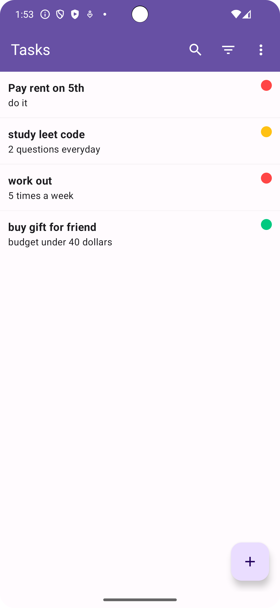
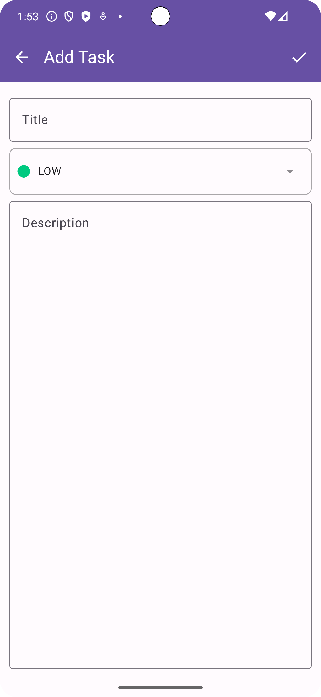

<p align="center">

<h1 align="center">✅ ToDo Compose ✅</h1>
<p align="center">
A simple and intuitive To-Do list application to help you stay organized.
</p>
</p>

ToDo Compose is a task management app designed for simplicity and efficiency. Whether you need to keep track of daily chores or long-term projects, ToDo Compose provides a clean and user-friendly interface to manage your tasks.


[](https://www.linkedin.com/in/timothysliu/)
[](mailto:timo9036@hotmail.com)

## Table of Contents

1. [Screenshots](#-screenshots)
2. [Features](#-features)
3. [Built With](#-built-with)
4. [Architecture](#️-architecture)
5. [Package Structure](#-package-structure)
6. [Installation](#️-installation)
7. [Contributing](#-contributing)
8. [License](#-license)

---

## 📸 Screenshots

Explore the app through these stunning visuals!

<table>
  <tr>
     <th>Main Page</th>
     <th>Add Task Page</th>
  </tr>

  <tr>
    <td>
           
   </td>
   <td>
           
   </td>
  </tr>

 </table>

## 🌟 Features

- **Create and Manage Tasks:** Easily add, edit, and delete your to-do items.
- **Prioritize Tasks:** Assign priority levels (High, Medium, Low) to your tasks.
- **Search Functionality:** Quickly find specific tasks using the search feature.
- **Sort Tasks:** Sort your tasks by priority to focus on what's important.
- **Clean Interface:** A minimalist and intuitive user interface.

## 🛠 Built With

<p align="center">
Explore the technology stack that powers ToDo Compose!
</p>

- [Kotlin](https://kotlinlang.org/) - First class and official programming language for Android development.
- [Coroutines](https://kotlinlang.org/docs/reference/coroutines-overview.html) - For asynchronous programming.
- [Flow](https://kotlin.github.io/kotlinx.coroutines/kotlinx-coroutines-core/kotlinx.coroutines.flow/-flow/) - A cold asynchronous data stream that sequentially emits values.
- [Jetpack Compose](https://developer.android.com/jetpack/compose) - Android’s modern toolkit for building native UI.
- [Android Architecture Components](https://developer.android.com/topic/libraries/architecture) - Collection of libraries that help you design robust, testable, and maintainable apps.
- [ViewModel](https://developer.android.com/topic/libraries/architecture/viewmodel) - Stores UI-related data that isn't destroyed on UI changes.
- [Room](https://developer.android.com/training/data-storage/room) - SQLite object mapping library.
- [DataStore Preferences](https://developer.android.com/topic/libraries/architecture/datastore) - A data storage solution that allows you to store key-value pairs.
- [Navigation Component](https://developer.android.com/guide/navigation/navigation-getting-started) - Helps you implement navigation, from simple button clicks to more complex patterns.
- [Dependency Injection](https://developer.android.com/training/dependency-injection) -
- [Hilt-Dagger](https://dagger.dev/hilt/) - A dependency injection library for Android that reduces the boilerplate of doing manual dependency injection in your project.
- [Material Components for Android](https://github.com/material-components/material-components-android) - Modular and customizable Material Design UI components for Android.
- [Gradle Kotlin DSL](https://docs.gradle.org/current/userguide/kotlin_dsl.html) - For writing Gradle build scripts using Kotlin.

## 🏛️ Architecture

ToDo Compose is based on the [***MVVM (Model-View-ViewModel)***](https://developer.android.com/jetpack/docs/guide#recommended-app-arch) architecture and the repository pattern.


## 📦 Package Structure
```
    🌐com.example.todo_compose   # Root Package
    .
    ├── 🧩components           # Reusable UI components
    │
    ├── 📂data                 # Data handling
    │   ├── 📝models          # Data models
    │   ├── 📚repositories    # Repositories for data operations
    │
    ├── 💉di                   # Dependency Injection
    │
    ├── 🗺️navigation          # Navigation-related classes
    │   └── 📍destinations    # Navigation destinations
    │
    ├── 🖼️ui                   # UI layer
    │   ├── 🎨screens         # UI screens
    │   ├── 🖌️theme           # App theme and styling
    │   └── 🧠viewmodels      # ViewModels
    │
    └── 🔧util                 # Utility classes
```
## ⬇️ Installation

To get started with ToDo Compose, follow these steps:

1.  Clone the repository.
2.  Open the project in Android Studio.
3.  Run the application on your device or emulator.

## 🙋 Contributing

Loved the app and want to contribute? Great! We welcome contributions. Send a PR now!

## 📝 License

ToDo Compose is released under the MIT License.

---

Happy organizing! 🎉
